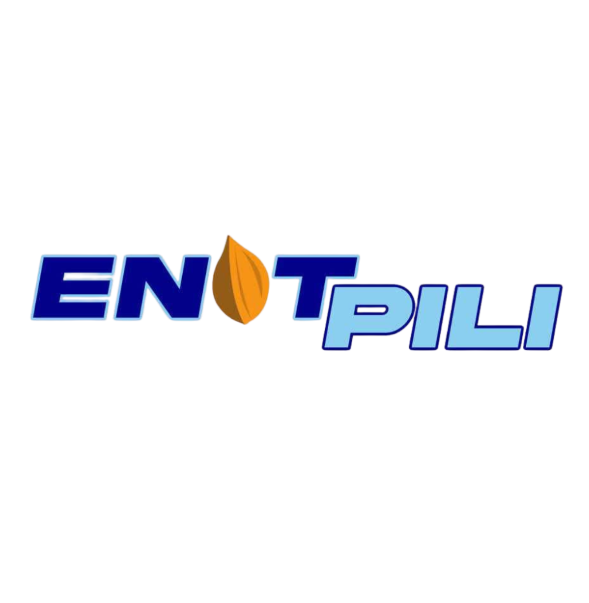

<div align="center">
  
  
  # E-PILI Portal
  ### Digital Governance Platform for Pili, Camarines Sur
  
  
  
  
  
  
</div>

---

## 📋 About

**E-PILI** (Electronic Portal for Integrated Local Information) is a full-stack digital governance platform serving the municipality of Pili, Camarines Sur, Philippines. It bridges citizens and local government through a unified web interface.

### Core Modules

| Module | Description |
|--------|-------------|
| 🏛️ **Document Requests** | Request barangay clearances, certificates, and IDs online |
| 🏪 **Marketplace** | Local business listings, products, and services |
| 🌾 **Market Prices** | Real-time Saod/Centro commodity price board |
| 💼 **Job Board** | Local employment postings |
| 🏥 **Health Services** | Doctor appointments and health records |
| 🤝 **Social Aid** | Assistance program listings and applications |
| ♻️ **Green Guard** | Environmental issue reporting and monitoring |
| 🚨 **Emergency** | Real-time emergency alerts and contacts |
| 🗳️ **Polls** | Community voting and freedom wall |
| 📊 **Admin Dashboard** | Workflow monitoring, analytics, and approvals |

---

## 🛠️ Tech Stack

**Backend**
- Laravel 9.x (PHP 8.2)
- MySQL / PostgreSQL
- Laravel Sanctum (session auth)
- Laravel WebSockets (real-time)
- Laravel Queues

**Frontend**
- Vue 3 (Composition API)
- Inertia.js
- Tailwind CSS
- Vite

---

## 🚀 Local Development Setup

### Requirements
- PHP 8.2+
- Composer
- Node.js 20+
- MySQL (port 3306 or 3307)

### Installation

```bash
# 1. Clone the repository
git clone https://github.com/YOUR_USERNAME/epili-portal.git
cd epili-portal

# 2. Install dependencies
composer install
npm install

# 3. Configure environment
cp .env.example .env
php artisan key:generate

# 4. Set up database
# Edit .env — set DB_HOST, DB_PORT, DB_DATABASE, DB_USERNAME, DB_PASSWORD
php artisan migrate
php artisan db:seed

# 5. Build frontend
npm run dev       # development (with hot reload)
# or
npm run build     # production build

# 6. Start the server
php artisan serve --host=0.0.0.0 --port=8000

# 7. (Optional) Start WebSocket server
php artisan websockets:serve --port=6001

# 8. (Optional) Start queue worker
php artisan queue:work
```

Visit: `http://localhost:8000`

### Default Accounts (after seeding)

| Role | Email | Password |
|------|-------|----------|
| Admin | admin@epili.gov.ph | password |
| Resident | resident@epili.gov.ph | password |
| Business | business@epili.gov.ph | password |

---

## ☁️ Deployment (GitHub + Render)

### Step 1 — Push to GitHub

```bash
# Make sure .env is in .gitignore (never commit secrets)
git add .
git commit -m "Initial commit"
git push origin main
```

### Step 2 — Free MySQL Database (PlanetScale)

1. Create account at [planetscale.com](https://planetscale.com)
2. New database → name: `epili` → region: **Asia Pacific (Singapore)**
3. Connect → Framework: Laravel → copy credentials

### Step 3 — Deploy on Render

1. [render.com](https://render.com) → **New Web Service**
2. Connect GitHub → select this repo
3. Configure:
   ```
   Name:    epili-app
   Region:  Singapore
   Runtime: nixpacks          ← auto-detected from nixpacks.toml
   Plan:    Free (or Starter)
   ```
4. Start command:
   ```
   php artisan migrate --force && php artisan storage:link --force && php -S 0.0.0.0:$PORT -t public
   ```

### Step 4 — Environment Variables on Render

Set these in Render → Your Service → **Environment**:

```env
APP_NAME=ENOT-PILI
APP_ENV=production
APP_DEBUG=false
APP_KEY=                          # click "Generate" in Render
APP_URL=https://your-app.onrender.com

DB_CONNECTION=mysql
DB_HOST=                          # from PlanetScale
DB_PORT=3306
DB_DATABASE=epili
DB_USERNAME=                      # from PlanetScale
DB_PASSWORD=                      # from PlanetScale

SESSION_DRIVER=database
SESSION_LIFETIME=480
SESSION_SECURE_COOKIE=true
SESSION_DOMAIN=
SANCTUM_STATEFUL_DOMAINS=your-app.onrender.com

CACHE_DRIVER=database
QUEUE_CONNECTION=database
FILESYSTEM_DISK=public
LOG_CHANNEL=stderr
LOG_LEVEL=error

BLOCKCHAIN_API_SECRET=            # set as secret
BLOCKCHAIN_CONTRACT_ADDRESS=0xc65bB3D1ddE97EAC0a6fd7Ba6FD7C1fb4eBC54d5
BLOCKCHAIN_NETWORK=polygon-amoy
```

### Step 5 — One-time setup after first deploy

In Render → Shell:

```bash
# Create tables needed for session/queue drivers
php artisan session:table
php artisan queue:table
php artisan migrate --force

# Seed initial data
php artisan db:seed --force
```

### Auto-deploy

Every `git push origin main` → Render rebuilds and redeploys automatically (~3 min).

---

## 📁 Project Structure

```
epili-portal/
├── app/
│   ├── Http/Controllers/     # Feature controllers
│   ├── Models/               # Eloquent models
│   ├── Notifications/        # Laravel notifications
│   └── Providers/
├── database/
│   ├── migrations/           # Database schema
│   └── seeders/
├── resources/
│   └── js/
│       ├── Components/       # Reusable Vue components
│       ├── Layouts/          # Page layouts
│       └── Pages/            # Inertia page components
├── routes/
│   ├── web.php               # Web routes
│   └── api.php               # API routes
├── nixpacks.toml             # Render build config
└── render.yaml               # Render infrastructure config
```

---

## 🔒 Security

- All routes protected via Laravel Sanctum session auth
- CSRF protection on all state-changing requests
- Role-based access: `admin`, `resident`, `business_owner`
- Rate limiting on auth and API endpoints
- Input validation on all form submissions

---

## 📄 License

This project is open-sourced software licensed under the [MIT license](LICENSE).

---

<div align="center">
  Built with ❤️ for the people of Pili, Camarines Sur 🇵🇭
</div>